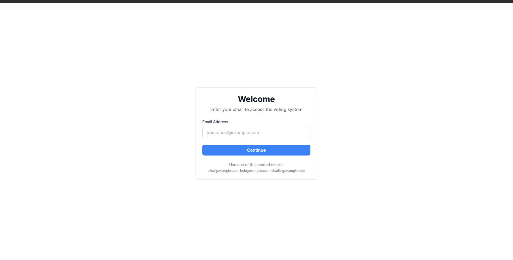
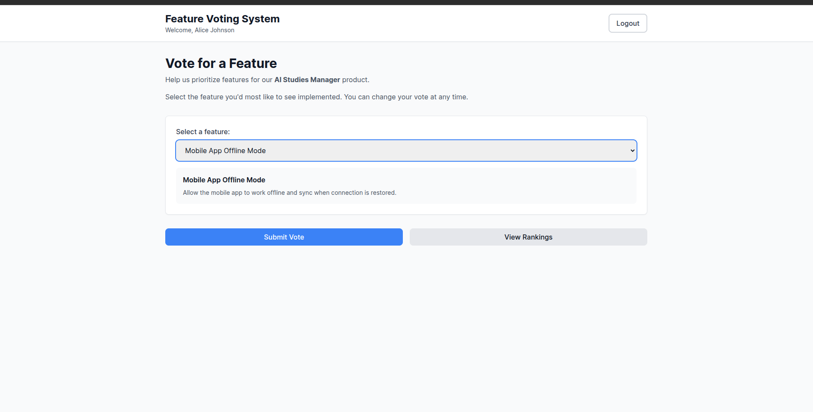
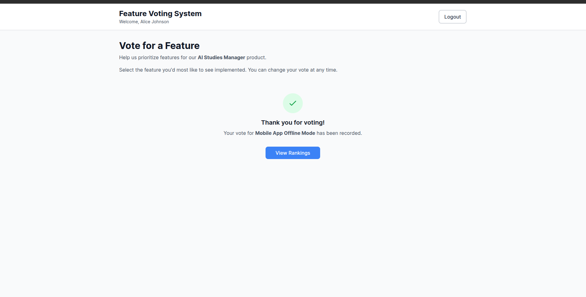
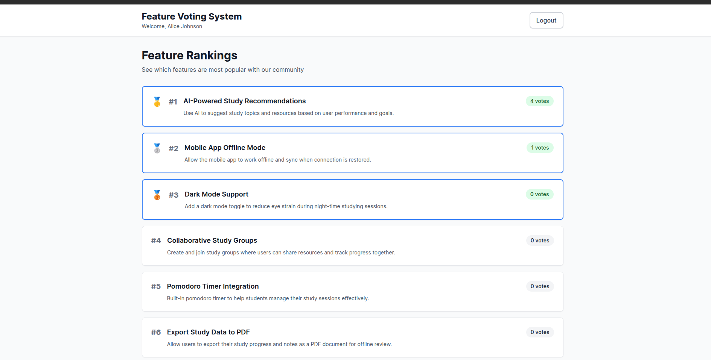
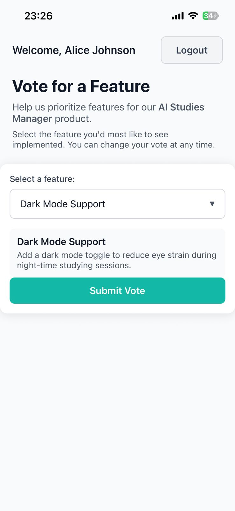
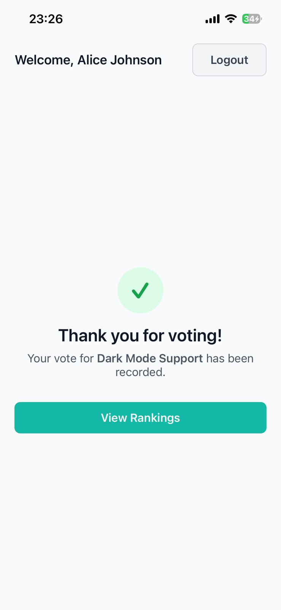
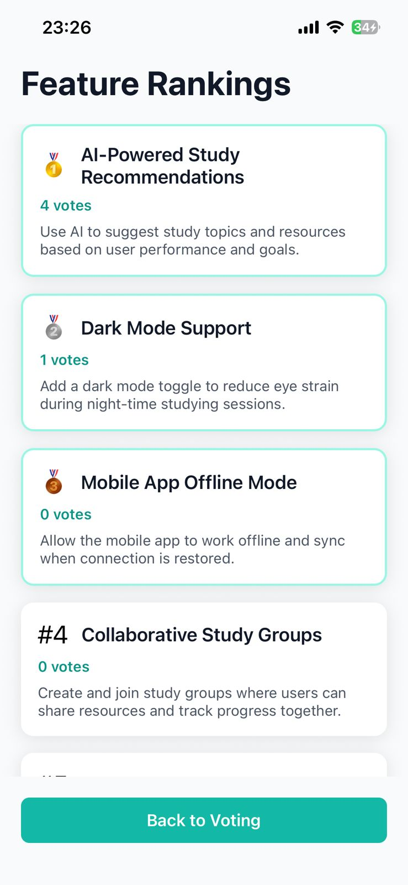

# Feature Voting System

A voting system for prioritizing product features across web and mobile platforms. Demonstrates clean architecture, system thinking, and AI-assisted development.

## Project Overview

Users can vote for their preferred features for the AI Studies Manager product. Each user can vote for one feature at a time and can change their vote.

**User Flows:**
- **Login:** Email-based authentication (no password required)
- **Voting:** Select a feature from a dropdown and submit vote
- **Ranking:** View features ordered by vote count with medals for top 3

## Architecture Overview

**Backend (Express + Prisma + SQLite):**
- User management and authentication
- Feature data and vote counting
- Single-vote-per-user constraint enforcement
- Atomic vote updates via database transactions

**Web Frontend (React + Vite):**
- Vote submission interface
- Real-time ranking display
- Built with TanStack Router for routing


| Login | Vote | Vote Success | Ranking |
|-------|------|--------------|---------|
|  |  |  |  |

**Mobile Frontend (React Native + Expo):**
- Same functionality as web
- Native navigation with React Navigation
- AsyncStorage for auth persistence

| Login | Vote | Vote Success | Ranking |
|-------|------|--------------|---------|
|  |  |  |  |

## Backend

**Database Schema:**
- `User`: id, email, name, createdAt
- `Feature`: id, title, description, createdAt, updatedAt
- `Vote`: id, userId, featureId, createdAt
  - Unique constraint on (userId, featureId)
  - Foreign keys to User and Feature

**API Routes:**
- `GET /api/users/email/:email` - Get or create user
- `GET /api/features` - List all features with vote counts
- `GET /api/votes` - List all votes
- `POST /api/features/:id/vote` - Submit or update vote

See [api-spec.yaml](./api-spec.yaml) for complete API documentation.

## Running the Project Locally

**Prerequisites:**
- Node.js >= 18
- pnpm >= 8

**Environment Variables:**

Each package has example environment files. Copy and customize as needed:

*Backend (.env):*
```bash
DATABASE_URL="file:./dev.db"
PORT=3000
NODE_ENV=development
CORS_ORIGIN=http://localhost:5173
```

*Web (.env):*
```bash
VITE_API_URL=http://localhost:3000
```

*Mobile (.env):*
```bash
# Android emulator
EXPO_PUBLIC_API_BASE_URL=http://10.0.2.2:3000/api

# Physical device (replace with your IP)
# EXPO_PUBLIC_API_BASE_URL=http://192.168.x.x:3000/api
```

Copy example files:
```bash
cp packages/backend/.env.example packages/backend/.env
cp packages/web/.env.example packages/web/.env
cp packages/mobile/.env.example packages/mobile/.env
```

**Start Backend:**
```bash
pnpm dev:backend
```
Backend runs on http://localhost:3000

**Start Web Frontend:**
```bash
pnpm dev:web
```
Web app runs on http://localhost:5173

**Start Mobile App:**

Set the backend API URL (optional):
```bash
export EXPO_PUBLIC_API_BASE_URL=http://<YOUR_IP>:3000/api
```

Then start the app:
```bash
pnpm dev:mobile
```

Defaults:
- Android emulator: `http://10.0.2.2:3000/api`
- Physical device: Uses IP from fallback config

Then:
- Scan QR code with Expo Go app on your device, or
- Press `a` to open in Android emulator

**For Android Emulator:**
```bash
pnpm android:mobile
```

## Testing

**Backend Unit Tests:**
```bash
pnpm test:backend
```
Tests cover service layer logic, vote constraint enforcement, and transaction handling.

**Web E2E Tests (Playwright):**
```bash
pnpm test:e2e
```
Tests cover complete user flows: login, voting, vote changes, and ranking display.

**Mobile Testing:**
Manual testing via Expo Go:
- Open Expo URL in mobile browser
- Redirect to Expo Go app
- Test login, voting, and ranking flows

Additional scripts:
- `pnpm test:e2e:ui` - Run E2E tests with Playwright UI
- `pnpm test:e2e:headed` - Run E2E tests in headed mode
- `pnpm test:e2e:debug` - Run E2E tests in debug mode

## Useful Notes

**Assumptions:**
- Email-based login without password is sufficient for this demo
- SQLite is acceptable for local development
- Single-vote-per-user is the core constraint
- Vote changes are allowed (not immutable votes)

**Constraints:**
- No authentication/authorization beyond email verification
- No vote history tracking
- No admin panel for feature management
- Features are seeded via database script

**Design Decisions:**
- Used email as primary identifier to simplify onboarding
- Optimistic updates removed from frontend to avoid race conditions
- Mobile app uses same API and patterns as web for consistency
- Android emulator uses `10.0.2.2` to access host's localhost
- Mobile API URL configurable via `EXPO_PUBLIC_API_BASE_URL` environment variable

**Known Limitations:**
- No production deployment configuration
- No real-time vote updates (requires manual refresh)
- Mobile app tested only on Android
- Package version warnings in mobile app (non-blocking)

## Future Features

**Authentication:**
- OAuth integration (Google, GitHub)
- Magic link email authentication
- Session management with JWT
